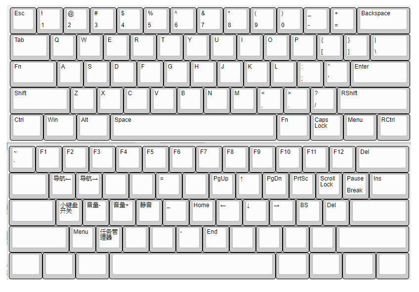
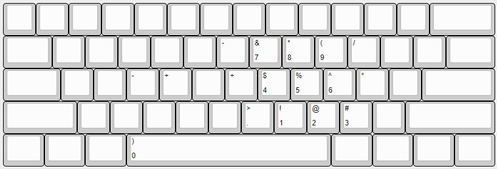

# GH60 Keymap

## 特性说明

GH60便携小巧，适合对键盘有比较高要求的人。

该方案基于同是60%键盘的poker3修改而来，针对程序员的使用习惯进行了一些优化，兼顾日常输入、编程和娱乐等使用场景。

### 基本布局



将标准键盘的Capslock、右Alt键位作为Fn键。

Capslock位做Fn是因为大小写切换并不需要频繁使用，而这个键位很容易用左手小拇指按到，以配合大量右手区的Fn层功能；右Alt键位做Fn，方便单用右手时使用Fn层功能。

文字编辑中最常用的一些键被安排在Fn层的右手区，`jlki`为=方向键，`hn`为home和end、`uo`为pageup和pagedown，配合左手的Capslock位的Fn键可以尽可能地减少手指的移动，提高操作效率。

* Capslock键被移到了右Alt的右边
* Fn+S/D/F分别对应音量调节减、加、静音
* Fn+为菜单键（Menu）
* Fn+X可以打开Windows中的任务管理器（Ctrl+Shift+Esc）

### 为程序员加入的一些设计

* Fn+G为`_`，Fn+T=`'`，Fn+V=`=`，适合程序员你懂的，尤其是下划线命名风格中，右手小拇指压力很大
* Fn+Q为组合键Alt+Left，Fn+W为组合键Alt+Right，一些编辑器中导航以此作为前后导航键

### 内嵌小键盘布局

Fn+A为小键盘模式开关。



### 右下方的方向键

右Fn+Space为右下脚方向键开关，适合需要用到方向键的游戏、看视频时单手操作方向键（手动滑稽）。


### 不常用特性（建议自行删除）

* Fn+E为组合键Ctrl+K，Eclipse快捷键“查找下一个”
* 右下脚的Menu键其实根本用不到，但这个鸡肋键位也似乎没什么价值

## Keymap

Editor:
http://www.keyboard-layout-editor.com/

配列生成工具：
https://tkg.io/

L0

```
["Esc","!\n1","@\n2","#\n3","$\n4","%\n5","^\n6","&\n7","*\n8","(\n9",")\n0","_\n-","+\n=",{w:2},"Backspace"],
[{w:1.5},"Tab","Q","W","E","R","T","Y","U","I","O","P","{\n[","}\n]",{w:1.5},"|\n\\"],
[{w:1.75},"Fn0","A","S","D","F","G","H","J","K","L",":\n;","\"\n'",{w:2.25},"Enter"],
[{w:2.25},"Shift","Z","X","C","V","B","N","M","<\n,",">\n.","?\n/",{w:2.75},"RShift"],
[{w:1.25},"Ctrl",{w:1.25},"Win",{w:1.25},"Alt",{w:6.25},"Space",{w:1.25},"Fn1",{w:1.25},"Caps Lock",{w:1.25},"Menu",{w:1.25},"RCtrl"]
```

L1 Fn层

```
["~\n`","F1","F2","F3","F4","F5","F6","F7","F8","F9","F10","F11","F12",{w:2},"Delete"],
[{a:7,w:1.5},"",{a:4},"Fn8","Fn9","Fn10","Fn11","Fn12","Fn13","PgUp","↑","PgDn","PrtSc","Scroll Lock","Pause\nBreak",{w:1.5},"Insert"],
[{a:7,w:1.75},"",{a:4},"Fn15","VolDn","VolUp","Mute","Fn16","Home","←","↓","→","backspace","Delete",{a:7,w:2.25},""],
[{w:2.25},"",{a:4},"App","Fn17","Fn18","Fn19","Fn20","End","Fn21","Fn22","Fn23","Fn24",{a:7,w:2.75},""],
[{w:1.25},"",{w:1.25},"",{w:1.25},"",{w:6.25},"",{w:1.25},"",{w:1.25},"",{w:1.25},"",{w:1.25},""]
```

L2 Fn层(空格为L1层开关)

```
["~\n`","F1","F2","F3","F4","F5","F6","F7","F8","F9","F10","F11","F12",{w:2},"Delete"],
[{a:7,w:1.5},"",{a:4},"Fn8","Fn9","Fn10","Fn11","Fn12","Fn13","PgUp","↑","PgDn","PrtSc","Scroll Lock","Pause\nBreak",{w:1.5},"Insert"],
[{a:7,w:1.75},"",{a:4},"Fn15","VolDn","VolUp","Mute","Fn16","Home","←","↓","→","backspace","Delete",{a:7,w:2.25},""],
[{w:2.25},"",{a:4},"App","Fn17","Fn18","Fn19","Fn20","End","Fn21","Fn22","Fn23","Fn24",{a:7,w:2.75},""],
[{w:1.25},"",{w:1.25},"",{w:1.25},"",{a:4,w:6.25},"Fn2",{a:7,w:1.25},"",{w:1.25},"",{w:1.25},"",{w:1.25},""]
```

L3 方向键

```
[{a:7},"","","","","","","","","","","","","",{w:2},""],
[{w:1.5},"","","","","","","","","","","","","",{w:1.5},""],
[{w:1.75},"","","","","","","","","","","","",{w:2.25},""],
[{w:2.25},"","","","","","","","","","","",{a:4,w:2.75},"↑"],
[{a:7,w:1.25},"",{w:1.25},"",{w:1.25},"",{w:6.25},"",{w:1.25},"",{a:4,w:1.25},"←",{w:1.25},"↓",{w:1.25},"→"]
```

Fn设置

```
"0":["ACTION_LAYER_MOMENTARY","1"],"1":["ACTION_LAYER_MOMENTARY","2"],"2":["ACTION_LAYER_TOGGLE","3"],"8":["ACTION_MODS_KEY","LR_LEFT",["MOD_ALT"],"KC_LEFT"],"9":["ACTION_MODS_KEY","LR_LEFT",["MOD_ALT"],"KC_RIGHT"],"10":["ACTION_MODS_KEY","LR_LEFT",["MOD_CTL"],"KC_K"],"11":["ACTION_NO"],"12":["ACTION_KEY","KC_EQUAL"],"13":["ACTION_NO"],"14":["ACTION_MODS_KEY","LR_LEFT",["MOD_SFT"],"KC_MINUS"],"15":["ACTION_KEY","KC_APPLICATION"],"16":["ACTION_MODS_KEY","LR_LEFT",["MOD_CTL","MOD_SFT"],"KC_ESCAPE"],"17":["ACTION_NO"],"18":["ACTION_KEY","KC_MINUS"],"19":["ACTION_NO"],"20":["ACTION_NO"],"21":["ACTION_NO"],"22":["ACTION_NO"],"23":["ACTION_NO"],"24":["ACTION_NO"]
```

> Fn0-Fn7，配列基本功能实现
> Fn8开始，用户自定义功能，可根据需要自行修改

## 配列数据的用法

1. **Layer Data**中定义了每层中有哪些按键，用keyboard-layout-editor.com可以编辑
2. 将**Layer Data**一层一层复制到tkg.io中，再把Fn设置信息用`工具-导入Fn设置`导入，再生成配列文件
3. 路线A.生成eep文件，用[tkg-toolkit](https://github.com/kairyu/tkg-toolkit)工具，把配列文件用[tkg-toolkit](https://github.com/kairyu/tkg-toolkit)烧到键盘上
   路线B.生成c文件，替换tmk源码中"keyboard/gh60/keymap_noodlefighter.c"，重新编译烧录

## 固件编译

依赖：

- dfu-programmer
- avr-gcc, avr-libc

> tkg-toolkit中明明有编译好的固件，为什么要费力自己编译呢？
> 最近发现tkg-toolkit中的固件烧上已经不能用了，编译最新的源码发现也不能用，原因不明
> 所以，以防万一还是自己把源码fork一份，自己管理好版本，记录下使用方法，以防多年后找不到能用的固件..

先参考[tmk的wiki](https://github.com/tmk/tmk_keyboard/wiki#build-on-linux)布置环境，然后执行：

```
$ git submodule update --init
$ ./build_and_upload.sh
```
